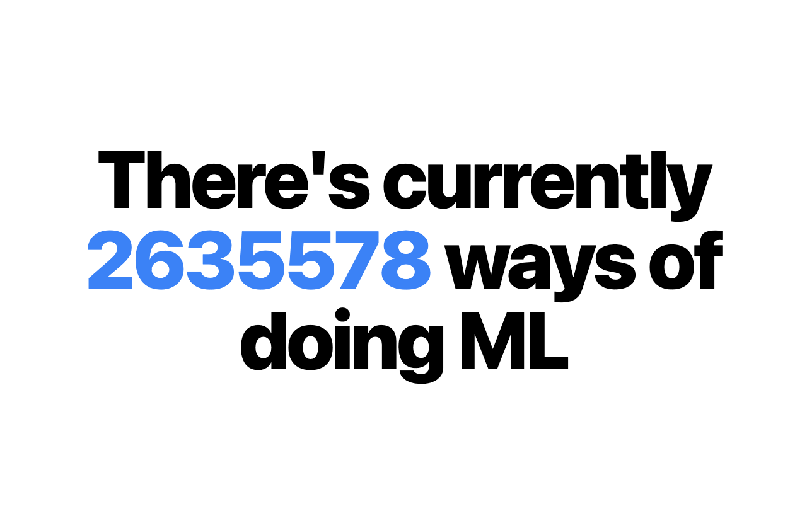

# WaysOfML



## Install dependencies

```sh
$ npm i
```

## Update data

Replace `data/landscape.csv` with exported csv from airtable. Then run `node parse.js`

## Update OG Image

Start dev server with `npm run dev` then `node ./lib/gen-og-image.js`

## Environment

To add GA id, run below command and fill up the GA id

```sh
$cp .env.local.example .env.local
```

## Export static website

```sh
$ npm run ghpages
```
